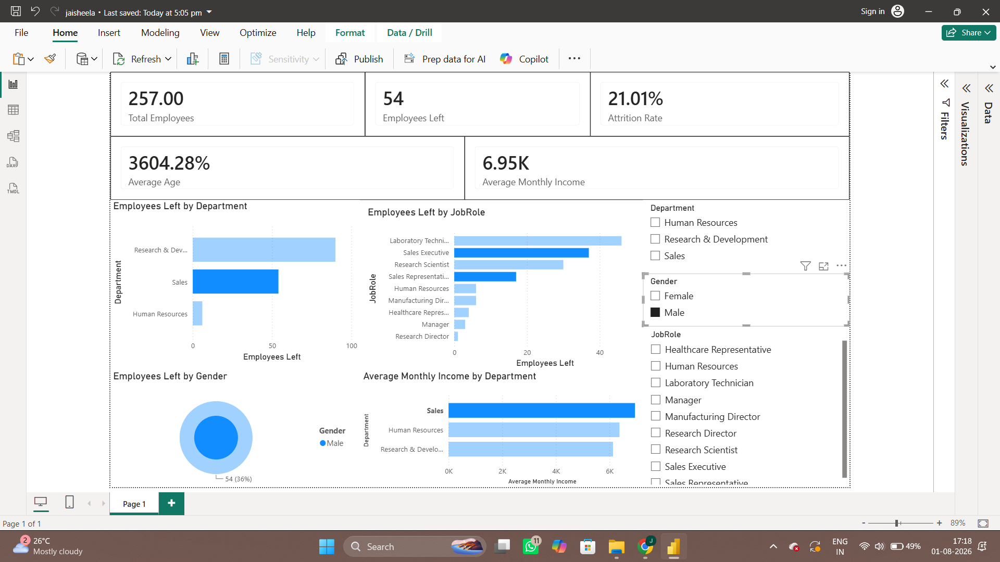

# HR Analytics Dashboard

## 📌 Project Overview

This project analyzes employee attrition and workforce trends using Python and Power BI.

## 🎯 Objective

To identify factors contributing to employee attrition and build an interactive dashboard for HR decision-making.

## 🛠 Tools Used

- Python
- Pandas
- NumPy
- Matplotlib
- Power BI
- DAX

## 📊 Key KPIs

- Total Employees
- Employees Left
- Attrition Rate
- Average Age
- Average Monthly Income

## 📈 Dashboard Features

- Employee Attrition by Department
- Employee Attrition by Job Role
- Employee Attrition by Gender
- Average Monthly Income by Department
- Interactive slicers for Department, Gender, and Job Role

## 💡 Key Insights

- Employee attrition rate is approximately 16%.
- Sales and Research & Development have the highest employee turnover.
- Sales Representatives and Laboratory Technicians show higher attrition.
- Employees with lower salaries are more likely to leave.
- Younger employees tend to have higher attrition.

## 📷 Dashboard Preview

(Add your dashboard screenshot here after uploading dashboard.png)

```

```

## 📁 Dataset

IBM HR Analytics Employee Attrition & Performance Dataset

## 🚀 Skills Demonstrated

- Data Cleaning
- Exploratory Data Analysis (EDA)
- Data Visualization
- Power BI Dashboard Design
- DAX Measures
- Business Insights